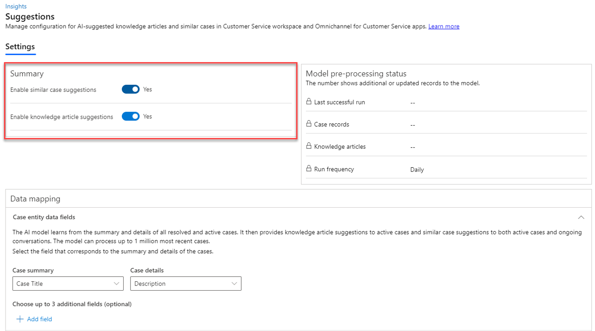

# Enable Smart Assist

## What is Smart Assist

Smart assist makes AI-based recomendations to agents. This can be used by agents
to:

- Identify similar cases
- Identify relevant knowledge articles
- Identify any other entities the bot is programmed to look for

## Enabling Smart Assist

The first prerequisite is that productivity tools are in the environment. This
is deployed for most new deployments. If it is not deployed we can install the
Productivity Tools app to the environment.

To confirm that the tools are deployed we can navigate to Admin Center ->
Productivity -> Productivity Tools. This should contain a record for smart
assist.

Next, we need to enable smart assist. This is done through Admin Center ->
Insights. We cannot access this in the trial, but it looks like there is a
section for suggestions for agents. In this we enable similar case suggestions
and knowledge article suggestions.

Finally, smart assist is accessed through the productivity pane. We need to
ensure that this is enabled in the relevant Agent Experience Profiles and that
smart assist has been turned on.

## Testing Smart Assist (Activity)

1. As a customer, initiate a conversation with chat
2. Accept the conversation in Workspaces
3. Open smart assist from the productivity panel
4. As a customer write: I am having trouble with my Contoso SmartBrew 3000
5. The smart assist panel should automatically update to find related articles

## Smart Assist for Similar Cases and Knowledge Articles

In the example above we use smart assist for similar cases and knowledge
articles. For this use case, we do not need to create custom bots. Suggestions
are powered by pretrained models.

We can customise the behavior of smart assist here in:

Admin Center -> Insights -> Suggestions for Representatives

As mentioned above, there are toggles to enable both similar case suggestions
and knowledge article suggestions. There is also a Data Mapping Section.



### Data Mapping

In the data mapping, we can customise the fields used to make suggestions for
both cases and knowledge articles.

By default, cases are suggested based on the case title and description. We can
add up to three more fields for the model to use when making suggestions.

For knowledge articles, title and content are used by default. Again we can
choose up to three different fields to use for comparison, e.g. keywords.

## Deploying a Smart Assist Bot

We do not need to deploy a custom bot for the above functionality. However, if
the above functionality is insufficient we may want to deploy a custom bot. At
this point things become very theoretical. At a very high level:

- We can build a smart bot using Azure Bot Service
- The bot can pass messages to agents using Microsoft Adaptive Cards

To connect the bot to Customer Service we need to:

- Create a bot user using Admin Center -> Bots
- Add the bot to a workstream in the Smart Assist Bots section

### Adaptive Cards

Adaptive Cards are used to deliver content to apps. The content of the card is
written in JSON according to a format defined by Microsoft. Apps that support
these cards can then display this content natively in the app.

Each case and knowledge article suggestion is passed as an adaptive card to
Workspaces which the Workspace App is then able to render.

```json
{
  "type": "AdaptiveCard",
  "version": "1.0",
  "body": [
    {
      "type": "TextBlock",
      "text": "Here is a ninja cat"
    },
    {
      "type": "Image",
      "text": "https://ninjacat.png"
    }
  ]
}
```

The format supports both elements such as text blocks and images, and actions,
for instance open a url.

## Summary

This is a deep topic and it is difficult to know the level of detail we need
here. The main points are that organisations can access and customise basic
smart assist functionality out of the box. This includes recommendations for
related cases and articles. To extend the functionality we would need to deploy
a custom bot, but I suspect the details of this are outside the scope of the
exam.
